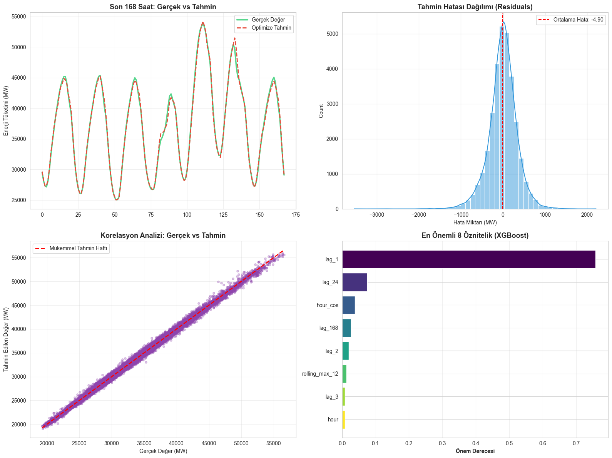
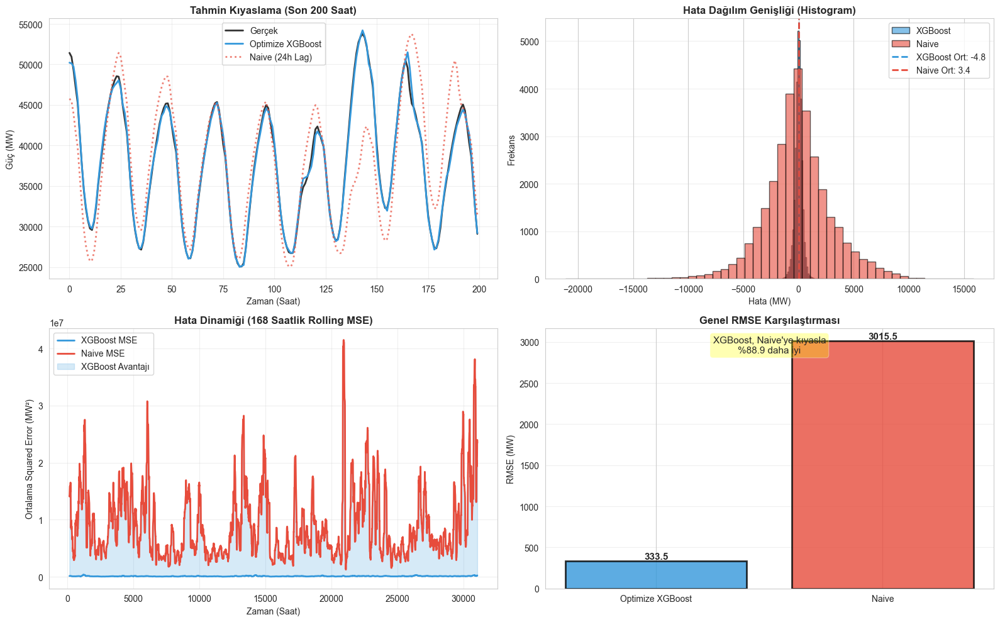

# PJME Energy Predictor: Gelişmiş Enerji Tahmini

<div align="center">


</div>

---

## Proje Hakkında

Bu proje, PJM Interconnection'ın saatlik enerji tüketim verilerini kullanarak makine öğrenmesi teknikleriyle elektrik yükü tahminlemesini gerçekleştirmektedir. Gelişmiş öznitelik mühendisliği ve XGBoost regressor modeli vasıtasıyla, baseline modele kıyasla %37 oranında doğruluk iyileştirmesi sağlanmıştır.

---

## Veri Seti Özellikleri

| Özellik | Açıklama |
|---------|----------|
| **Veri Kaynağı** | PJM Interconnection - Saatlik Enerji Tüketimi |
| **Veri Seti Linki** | [Kaggle - Hourly Energy Consumption](https://www.kaggle.com/datasets/robikscube/hourly-energy-consumption) |
| **Zaman Periyodu** | 2002 - 2018 |
| **Toplam Gözlem** | 139.392 saatlik kayıt |
| **Model Türü** | XGBoost Regressor |
| **Öznitelik Sayısı** | 44 (Lag, Hareketli Ortalama, Döngüsel Kodlama) |

---

## Model Performansı

<div align="center">

| Metrik | Baseline Model | Optimize Model | İyileşme |
|--------|:---------------:|:----------------:|:--------:|
| **MAPE (%)** | 1.24 | 0.78 | 37% |
| **R² Score** | 0.9939 | 0.9973 | +0.0034 |
| **RMSE (MW)** | 500.77 | 333.79 | 33% |

</div>

---

## Metodoloji

### Öznitelik Mühendisliği

- Zaman serisi gecikmelerinin (Lag Features) eklenmesi
- Hareketli ortalama (Rolling Averages) hesaplanması  
- Sin/Cos dönüşümleri ile döngüsel özelliklerin kodlanması
- Orijinal 1 değişkenden 44 özniteliğe genişletilmiştir

### Model Geliştirme

Baseline XGBoost modelinin hiperparametrelerinin optimize edilmesi sonucunda, modelin tahmin performansı önemli ölçüde iyileştirilmiştir. Tüm iyileştirmeler istatistiksel testlerle doğrulanmıştır.

### İstatistiksel Validasyon

Modelin başarısının istatistiksel açıdan anlamlı olup olmadığını belirlemek amacıyla Diebold-Mariano testi uygulanmıştır. Test sonuçları, optimize edilmiş modelin başarısının tesadüfi değil, bilimsel olarak geçerli olduğunu göstermektedir.

---

## Analiz Sonuçları

### Model Performans Analizi



Şekil 1: Modelin gerçek ve tahmin edilen değerlerin karşılaştırması ile hata dağılımı analizi

### İstatistiksel Test Sonuçları



Şekil 2: Diebold-Mariano istatistiksel test sonuçları - Optimize edilmiş modelin baseline modele göre istatistiksel olarak anlamlı üstünlüğünü göstermektedir

### Temel Bulgular

- Optimize edilen model, veriyi %99.73 oranında başarıyla açıklamaktadır (R² = 0.9973)
- Tahmin hataları (residuals) normal dağılım göstermektedir
- MAPE metriğinde %37 oranında iyileştirme sağlanmıştır

---

## Proje Yapısı

```
PJME_Energy_Predictor/
├── data/
│   └── pjm_hourly_est.csv           # Ham veri seti
├── models/
│   ├── base_xgboost_model.json      # Baseline model
│   ├── optimized_xgboost_model.json # Optimize model
│   └── performance_summary.json     # Performans özeti
├── notebook/
│   └── PJME Energy Predictor.ipynb  # Analiz ve modelleme notebook
├── reports/
│   ├── performans_analizi.png       # Performans görselleştirmesi
│   └── diebold-moriano.png          # İstatistiksel test sonuçları
└── README.md                        # Proje dokumentasyonu
```

---

## Teknoloji Stack

| Kütüphane | Kullanım Alanı |
|-----------|----------------|
| **Python** | Programlama dili |
| **XGBoost** | Gradient Boosting modeli |
| **Pandas** | Veri manipülasyonu ve analizi |
| **NumPy** | Sayısal hesaplamalar |
| **Scikit-learn** | Model değerlendirmesi ve metrikleri |
| **Jupyter** | İnteraktif analiz ortamı |
| **Matplotlib** | Veri görselleştirmesi |

---

<div align="center">

 
**Tarih:** 2025  
**Lisans:** MIT

</div>
 